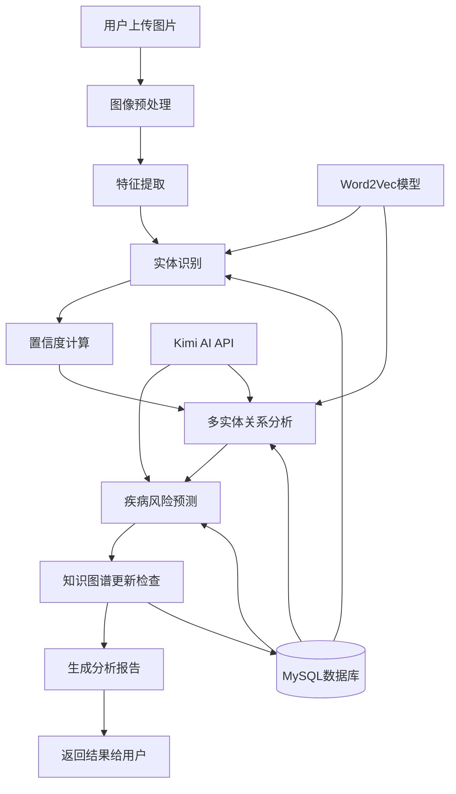
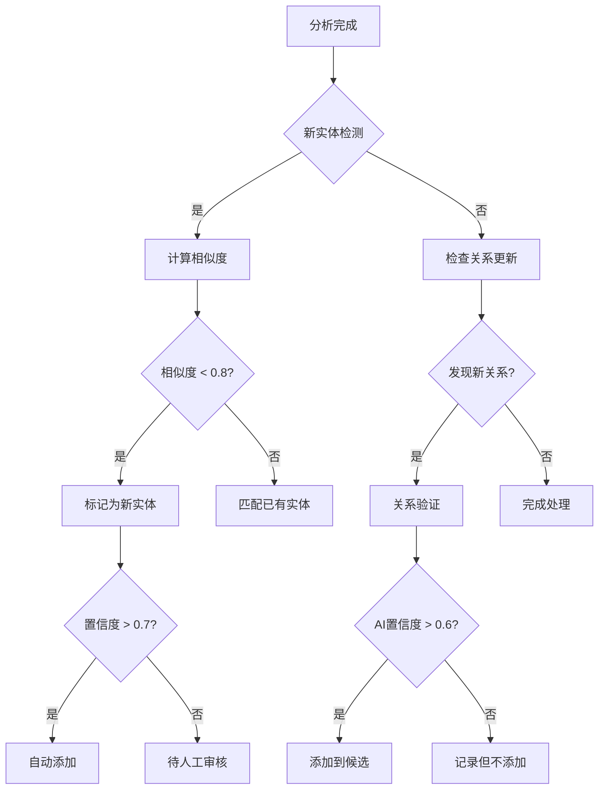

# 松材线虫病知识图谱图像分析系统架构概览

## 🏗️ 系统整体架构

```
┌─────────────────────────────────────────────────────────────┐
│                     前端界面层 (Vue.js)                      │
├─────────────────────────────────────────────────────────────┤
│  知识图谱展示页面  │  图像分析页面  │  历史记录  │  帮助文档   │
└─────────────────┬───────────────┬─────────────┬─────────────┘
                  │               │             │
                  ▼               ▼             ▼
┌─────────────────────────────────────────────────────────────┐
│                    API网关层 (FastAPI)                      │
├─────────────────────────────────────────────────────────────┤
│  /api/graph/*   │ /api/image/*  │ /api/entities/* │ /api/*  │
└─────────────────┬───────────────┬─────────────────┬─────────┘
                  │               │                 │
                  ▼               ▼                 ▼
┌─────────────────────────────────────────────────────────────┐
│                      业务逻辑层                              │
├─────────────┬─────────────┬─────────────┬─────────────┬─────┤
│图谱管理服务   │图像分析服务   │知识推理服务   │多实体分析    │更新服务│
│GraphService │ImageAnalysis │KnowledgeInfer│MultiEntity  │Updater│
└─────────────┴─────────────┴─────────────┴─────────────┴─────┘
                  │               │                 │
                  ▼               ▼                 ▼
┌─────────────────────────────────────────────────────────────┐
│                     数据存储层                               │
├─────────────────────────────────────────────────────────────┤
│     MySQL数据库        │    Word2Vec模型    │   AI服务API    │
│   knowledge_triples    │   (语义相似度)     │   (Kimi API)   │
└─────────────────────────────────────────────────────────────┘
```

## 📦 核心模块详解

### 1. 前端界面层 (Vue.js + Element Plus)

#### 🏠 主页 (HomeView.vue)
- **功能**: 知识图谱可视化展示
- **交互**: 节点/边点击编辑、智能实体添加
- **组件**: KnowledgeGraph.vue (D3.js图谱渲染)

#### 🎯 图像分析页 (ImageAnalysisView.vue)
- **功能**: 图像上传、分析进度、结果展示
- **组件**: ImageAnalysis.vue (核心分析界面)
- **特性**: 多标签页结果展示、实时进度更新

#### 🔧 通用组件
- **路由管理**: Vue Router 4
- **状态管理**: Vuex (轻量级状态)
- **API通信**: axios封装 (api/index.js)

### 2. API网关层 (FastAPI)

#### 🌐 主要API端点

```python
# 知识图谱相关
GET  /api/graph                    # 获取完整图谱数据
POST /api/nodes                    # 添加新节点
PUT  /api/nodes/{id}              # 更新节点
DEL  /api/nodes/{id}              # 删除节点

# 图像分析相关  
POST /api/image/analyze           # 图像分析主接口
POST /api/entities/validate       # 多实体关系验证

# 辅助功能
GET  /api/analysis/history        # 获取分析历史
GET  /api/suggestions/updates     # 获取更新建议
```

#### 🔐 中间件
- **文件上传**: 多媒体文件处理 (最大10MB)
- **错误处理**: 统一异常捕获和响应
- **CORS配置**: 前端跨域访问支持

### 3. 业务逻辑层

#### 🎨 图像分析服务 (image_service.py)

```python
class ImageAnalysisService:
    - analyze_image()          # 主分析流程
    - preprocess_image()       # 图像预处理
    - extract_features()       # 特征提取
    - recognize_entities()     # 实体识别
    - calculate_confidence()   # 置信度计算
```

**识别实体类型**:
- 🦗 昆虫类 (松墨天牛等传播媒介)
- 🌲 植物类 (马尾松、黑松等寄主)
- 🏥 病症类 (枯萎、变色等症状)
- 🌍 环境类 (土壤、气候等因素)

#### 🧠 知识推理服务 (knowledge_inference_service.py)

```python
class KnowledgeInferenceService:
    - analyze_disease_prediction()  # 疾病风险预测
    - generate_recommendations()    # 治疗建议生成
    - assess_risk_level()          # 风险等级评估
    - query_treatment_protocols()  # 查询防治方案
```

**预测维度**:
- 📈 风险等级: 高/中/低风险评估
- 🎯 可能性: 发病概率百分比
- ⏰ 时间窗口: 预期发病时间
- 🛡️ 防治建议: 具体处理方案

#### 🔗 多实体分析服务 (multi_entity_analyzer.py)

```python
class MultiEntityAnalyzer:
    - analyze_entity_relationships() # 关系分析主流程
    - validate_known_relationships() # 验证已知关系
    - infer_potential_relationships() # AI推理新关系
    - resolve_conflicts()           # 冲突关系处理
```

**关系类型**:
- 🦠 病理关系: 致病、传播、感染
- 🌱 生态关系: 寄主、捕食、共生  
- 🌍 环境关系: 影响、适应、分布
- ⏰ 时序关系: 发展、演化、周期

#### 📊 知识图谱更新服务 (knowledge_updater.py)

```python
class KnowledgeGraphUpdater:
    - process_analysis_result()     # 处理分析结果
    - check_similarity_threshold()  # 检查相似度阈值
    - add_new_entities()           # 添加新实体
    - update_relationships()       # 更新关系
    - maintain_consistency()       # 维护一致性
```

**更新策略**:
- 🎯 相似度阈值: 0.8以下视为新实体
- ✅ 自动更新: 高置信度直接添加
- 👨‍🔬 人工审核: 低置信度待审核
- 🔄 增量更新: 避免数据冗余

### 4. 数据存储层

#### 🗄️ MySQL数据库

**核心表结构**:
```sql
-- 知识三元组表
knowledge_triples:
  - id (主键)
  - head_entity (头实体)
  - relation (关系类型) 
  - tail_entity (尾实体)
  - confidence (置信度)
  - source (数据来源)
  - created_at (创建时间)

-- 实体特征表  
entity_features:
  - entity_name (实体名称)
  - features (特征向量JSON)
  - entity_type (实体类型)
  - updated_at (更新时间)

-- 分析历史表
analysis_history:
  - id (分析ID)
  - image_path (图片路径)
  - analysis_result (分析结果JSON)
  - risk_level (风险等级)
  - created_at (分析时间)
```

#### 🤖 AI服务集成

**Word2Vec模型**:
- 📍 路径: `training_word2vec/model/`
- 🎯 用途: 计算实体语义相似度
- 📊 维度: 100维词向量
- 🔄 更新: 定期重训练

**Kimi AI API**:
- 🧠 功能: 自然语言推理和生成
- 🔗 用途: 关系推理、建议生成
- ⚡ 响应: 异步调用处理
- 🛡️ 容错: 本地模拟备用方案

## 🔄 数据流处理

### 图像分析完整流程



### 知识更新决策流程



## ⚡ 性能优化策略

### 前端优化
- **懒加载**: 路由级别代码分割
- **组件缓存**: keep-alive缓存分析结果
- **图片压缩**: 上传前自动压缩处理
- **虚拟滚动**: 大量结果的高效渲染

### 后端优化
- **异步处理**: FastAPI异步IO处理
- **连接池**: 数据库连接复用
- **缓存机制**: Redis缓存热点数据
- **批量处理**: 数据库批量插入优化

### 数据库优化
- **索引策略**: 实体名称、关系类型索引
- **分区表**: 按时间分区历史数据
- **查询优化**: 避免N+1查询问题
- **定期维护**: 自动清理过期数据

## 🔒 安全性设计

### 数据安全
- **输入验证**: 严格的文件类型和大小检查
- **SQL注入防护**: 参数化查询
- **文件安全**: 上传文件类型白名单
- **数据脱敏**: 敏感信息加密存储

### 访问控制
- **接口限流**: 防止API滥用
- **文件隔离**: 上传文件沙箱存储
- **错误处理**: 避免信息泄露
- **日志审计**: 完整的操作日志

## 🚀 未来扩展方向

### 功能增强
- **模型训练**: 集成自定义图像识别模型训练
- **多模态分析**: 支持视频、音频等多媒体分析
- **实时监控**: 集成IoT设备进行实时病害监测
- **移动端适配**: 开发移动应用版本

### 技术升级
- **微服务架构**: 服务拆分和容器化部署
- **图数据库**: 使用Neo4j等专业图数据库
- **机器学习**: 集成TensorFlow/PyTorch深度学习框架
- **云服务集成**: 支持AWS、Azure等云平台部署

### 生态建设
- **开放API**: 提供第三方集成接口
- **插件系统**: 支持自定义分析算法插件
- **知识共享**: 建立专家知识贡献平台
- **标准化**: 参与行业标准制定

---

该架构设计确保了系统的可扩展性、可维护性和高性能，为松材线虫病防治提供了强有力的技术支持。